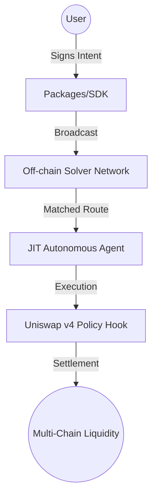

# ⚓ JACK: Just-in-time Autonomous Cross-chain Kernel

> "The bridge is a bottleneck. The intent is the destination."

JACK is a production-grade, intent-based execution kernel designed to orchestrate cross-chain operations through autonomous agents. By utilizing JIT (Just-In-Time) settlement and FHE (Fully Homomorphic Encryption) constraints, JACK ensures optimal execution with zero-leakage of user strategies.

## 🏗 System Architecture



## 📂 Monorepo Structure

| Path | Purpose | Stack |
| :--- | :--- | :--- |
| `apps/landing` | High-fidelity 3D Cinematic Entry | React + Three.js + R3F |
| `apps/dashboard` | Mission Control & Intent Builder | React + Tailwind + Lucide |
| `packages/sdk` | Core logic, EIP-712 signing, & API | TypeScript + Viem |
| `packages/ui` | Shared Design System Components | Shadcn + Radix |
| `contracts` | Policy Hooks & Settlement Adapters | Solidity + Foundry |

## 🛠 Tech Stack

- **Monorepo Management:** [Turborepo](https://turbo.build/) + [pnpm](https://pnpm.io/)
- **Frontend:** React 19, Tailwind CSS, Framer Motion
- **3D Engine:** Three.js / @react-three/fiber
- **Blockchain:** Solidity, Foundry, Viem
- **Privacy:** Fhenix (FHE) for encrypted constraints

## 🚦 Getting Started

### Prerequisites
- Node.js >= 18
- pnpm >= 8
- Foundry (for contracts)

### Installation
```bash
pnpm install
```

### Development
Launch all applications and packages in development mode:
```bash
pnpm dev
```

### Deployment Pipeline
```bash
pnpm build  # Optimized production build across all workspaces
pnpm test   # Run unit and contract tests
pnpm lint   # Enforce code quality standards
```

## 🛡 Security & Compliance
JACK utilizes **Dual-Constraint Verification**:
1. **Cryptographic Proof:** EIP-712 signatures for intent integrity.
2. **On-chain Enforcement:** Uniswap v4 Hooks verify slippage and policy adherence *at the moment of swap*, preventing front-running and solver-malice.

---
*Built for the cross-chain future.*
